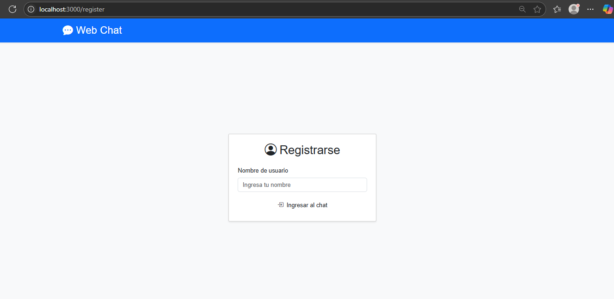
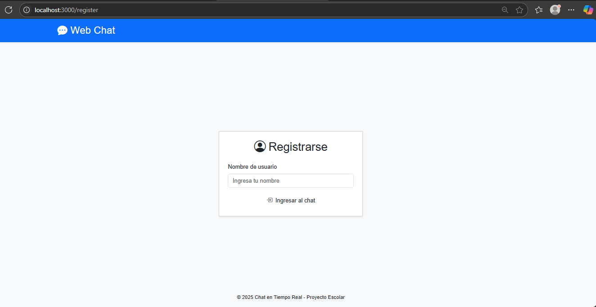

# 💬 Chat en Tiempo Real con Sockets

## 👨‍💻 Nombre del Estudiante  
**Elvis Ramírez**

## 📅 Fecha de Entrega  
30 de mayo de 2025

---

## 🧾 Introducción

Este proyecto consiste en un sistema de chat en tiempo real implementado utilizando **Sockets** con Node.js y Socket.IO. El objetivo es permitir que varios usuarios puedan intercambiar mensajes de manera instantánea en una interfaz amigable y moderna.

El uso de **sockets** es esencial en aplicaciones de comunicación en tiempo real como chats, juegos en línea y colaboración simultánea, ya que permite una conexión bidireccional continua entre el cliente y el servidor.

---

## 📂 Repositorio Base

- Repositorio original proporcionado por el docente:  
  🔗 [https://github.com/paulosk8/webChat/tree/main](https://github.com/paulosk8/webChat/tree/main)

- Estructura de ramas del repositorio original:
  - `main`: Contiene el código inicial.
  - `implementacion-chat`: Contiene la versión final del proyecto como referencia.

- En este proyecto:
  - Se clonó el repositorio base.
  - Se trabajó en una nueva rama de desarrollo:

    ```bash
    git checkout -b ElvisRamirez
    ```

---

## 🛠️ Implementación del Proyecto

### 📁 Estructura del Código

src/
├── public/
│ ├── css/ # Estilos personalizados
│ ├── img/ # Imágenes utilizadas en la interfaz
│ └── js/ # Lógica del cliente
└── server.js # Lógica del servidor con configuración de sockets

### 🎨 Mejoras al Diseño

- Interfaz completamente rediseñada con estilos CSS personalizados.
- Imágenes de perfil para mejorar la estética.
- Botones y disposición visual optimizados para una mejor experiencia.
- Adaptación básica a dispositivos móviles.

### 🌟 Características Adicionales

- 📛 Ingreso de nombre de usuario personalizado antes de iniciar el chat.
- 🧍 Imagen de perfil en los mensajes.
- 🕘 Timestamps (hora exacta de cada mensaje).
- ✅ Notificación sonora y visual al recibir nuevos mensajes.
- 📱 Diseño parcialmente responsivo.

---

## ▶️ Instrucciones de Ejecución

1. **Clonar el repositorio:**

    ```bash
    git clone https://github.com/ElvisRamirez/WebChat-Socket-ElvisRamirez.git
    cd WebChat-Socket-ElvisRamirez
    ```

2. **Instalar dependencias:**

    ```bash
    npm install
    ```

3. **Ejecutar el servidor:**

    ```bash
    node src/server.js
    ```

4. **Abrir en el navegador:**

    Ir a: [http://localhost:3000](http://localhost:3000)

---

## 🖼️ Capturas de Pantalla

### 🧵 Vista del Chat General  


### 🧍‍♂️ Envío de Mensajes con Perfil  


---

## 📌 Conclusiones

Durante el desarrollo de este proyecto se reforzaron conocimientos sobre:

- Implementación de comunicación en tiempo real con **Socket.IO**.
- Estructuración y diseño de aplicaciones web.
- Manejo de ramas en Git y GitHub para proyectos colaborativos.
- Aplicación de estilos visuales CSS y uso de elementos multimedia.

### 🧱 Dificultades enfrentadas

- Problemas con la sincronización de ramas remotas y locales (resuelto con `git pull --rebase`).
- Ajustes de diseño para que los mensajes se visualizaran adecuadamente en diferentes resoluciones.

---

## 📚 Referencias

- [Documentación de Socket.IO](https://socket.io/docs/)
- [MDN Web Docs - CSS](https://developer.mozilla.org/es/docs/Web/CSS)
- [Repositorio Base GitHub - paulosk8/webChat](https://github.com/paulosk8/webChat)
- [Font Awesome Icons](https://fontawesome.com/)
- [W3Schools CSS Layouts](https://www.w3schools.com/css/css_rwd_intro.asp)

